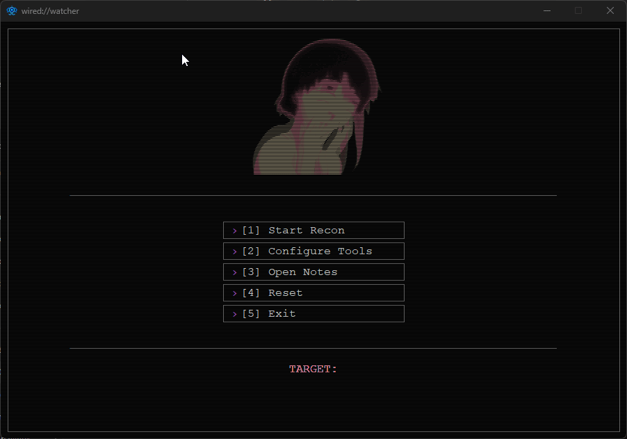
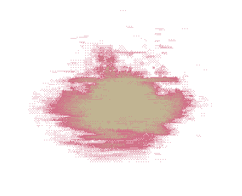
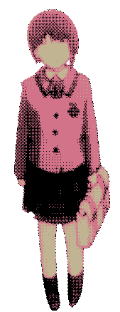

<h1>
wired://watcher

</h1>

> *Simple reconnaissance tool for CTF challenges*

A sleek, terminal-style GUI tool designed for initial reconnaissance in CTF competitions. Built with a retro CRT aesthetic.


<div align="center">
  
</div>


## Features

- **Automated Reconnaissance**: Runs Nmap and directory fuzzing in one click
- **Retro CRT Interface**: Lain themed UI with scanlines and animations
- **Notes Viewer**: Review scan results
- **Configurable**: Customize Nmap and fuzzer commands
- **Persistent Config**: Saves your target and settings between sessions

## Current Tools

- **Nmap**: Port scanning and service enumeration
- **Gobuster/FFUF**: Directory and file fuzzing with custom wordlists

<div align="center">
  
</div>

## Requirements

### Python Dependencies
```bash
pip install -r requirements.txt
```

**Required:**
- Python 3.8+
- Pillow (for GIF animations)
- tkinter (install via your OS package manager):
  **Linux:**
  - Debian / Ubuntu / Linux Mint (apt):
    ```bash
    sudo apt update
    sudo apt install python3-tk
    ```
  - Fedora / RHEL / AlmaLinux / OracleLinux (dnf):
    ```bash
    sudo dnf install python3-tkinter
    ```
  - openSUSE (zypper):
    ```bash
    sudo zypper install python3-tk
    ```
  - Arch Linux / Manjaro (pacman):
    ```bash
    sudo pacman -S tk
    ```
  **Windows:**
  - Tkinter is included with the Python installer; no additional installation needed.

### External Tools
Make sure these are installed and in your PATH:
- [Nmap](https://nmap.org/)
- [Gobuster](https://github.com/OJ/gobuster) or [FFUF](https://github.com/ffuf/ffuf)


<div align="center">
  
</div>

## Installation

### Releases

Pre-built executables are available in the [Releases](../../releases) section. Download the latest version for your platform and run directly.

### Or you can download it and run "wiredwatcher.py" with python :P

### From Source
```bash
# Clone or download the repository
cd wired-watcher

# Install dependencies
pip install -r requirements.txt

# Run
python wiredwatcher.py
```

### Build Executable (Optional)

```bash
# Install PyInstaller
pip install pyinstaller

# Build
python3 -m PyInstaller --onefile --noconsole \
--add-data "config.json:." \
--add-data "modules:modules" \
--hidden-import=PIL._tkinter_finder \
wiredwatcher.py

# Executable will be in dist/ | you just need to chmod +x it

# To use it as an app you need to create a shortcut

nano ~/.local/share/applications/wiredwatcher.desktop

# Then add this modifying it with your info

[Desktop Entry]
Name=wired://watcher
Comment=Simple reconnaissance tool for CTF challenges
Exec=executable_location
Icon=icon_location
Terminal=false
Type=Application
Categories=Utility;

# Save it and turn it into an executable

chmod +x ~/.local/share/applications/wiredwatcher.desktop


# If you wish to use some nmap command that requires sudo, don't forget to:

echo "UrUser ALL=(root) NOPASSWD: /usr/bin/nmap" | sudo EDITOR="tee -a" visudo

```

<div align="center">
  
</div>

## Usage

1. **Launch** the application
2. **Enter target** (e.g., `10.10.10.1`, `https://example.com`)
3. **Configure tools** (optional) - set custom Nmap flags and wordlist paths
4. **Start Recon** - automated scanning begins
5. **View Notes** - review results in real-time or after completion
6. **Reset** - clear all results and start fresh

### Menu Options
- `[1] Start Recon` - Begin reconnaissance on configured target
- `[2] Configure Tools` - Customize Nmap/fuzzer commands and wordlist
- `[3] Open Notes` - View scan results in separate window
- `[4] Reset` - Delete all scan outputs
- `[5] Exit` - Close application

## Configuration

Settings are stored in `config.json`:
```json
{
    "current_target": "10.10.10.1",
    "wordlist_path": "~/wordlists/common.txt",
    "fuzzer_choice": "gobuster",
    "nmap": "nmap -sC -sV target",
    "gobuster": "gobuster dir -u target -w wordlist.txt -x php,txt,html,js"
}
```

**Placeholders:**
- `target` - automatically replaced with your configured target
- `wordlist.txt` - replaced with your wordlist path

<div align="center">
  
</div>

## Interface

- **Animated GIFs**: Random Lain gif on the top of the screen - Thanks to [Fauux](https://fauux.neocities.org/)
- **CRT Effects**: Scanlines and subtle screen flicker
- **Color Scheme**: Purple/pink 

## Future Ideas

While wired://watcher currently focuses on Nmap and fuzzing, future versions will include:

- **Subdomain Enumeration** (subfinder, amass)
- **Technology Detection** (Wappalyzer, WhatWeb)
- **DNS Enumeration** (dnsrecon, dnsenum)
- **Web Crawling** (gospider, hakrawler)
- **Report Generation** (HTML/PDF exports)

Contributions and suggestions are welcome!

<div align="center">
  
</div>

## Project Structure

```
wired-watcher/
├── config.json             # User configuration
├── requirements.txt        # Python dependencies
├── icon.ico                # Icon in case you want to build it yourself
├── wiredwatcher.py         # Entry point
└── modules/
    ├── animations.py      # CRT effects
    ├── config.py          # App constants
    ├── config_tools.py    # Settings UI
    ├── event_handlers.py  # Input handling
    ├── gif_loader.py      # GIF processing
    ├── notes_viewer.py    # Results viewer
    ├── recon_executor.py  # Tool execution
    ├── ui_components.py   # Interface drawing
    └── assets/
        ├── *.gif          # gifs
        └── icon.ico       # App icon
```

## Keyboard Shortcuts - 

- **ESC** - Close notes viewer or exit application
- **Enter** - Confirm target input
- **Click** - Select menu options

<div align="center">
  
</div>

## Contributing

Ideas for improvements:
- Add more reconnaissance tools
- Enhance output parsing and formatting
- Add export functionality
- Improve error handling
- Create tool presets for common scenarios

## License

MIT License - Feel free to use in CTFs and modify as needed!

## Credits

- UI inspiration: Serial Experiments Lain
- [Fauux](https://fauux.neocities.org/) again for the gifs in his website
- Built for the CTF community

---

**Note**: This tool is for authorized security testing and CTF competitions only. Always ensure you have permission before scanning targets.

*Present day, present time... ハハハハ*

<div align="center">
  
</div>
